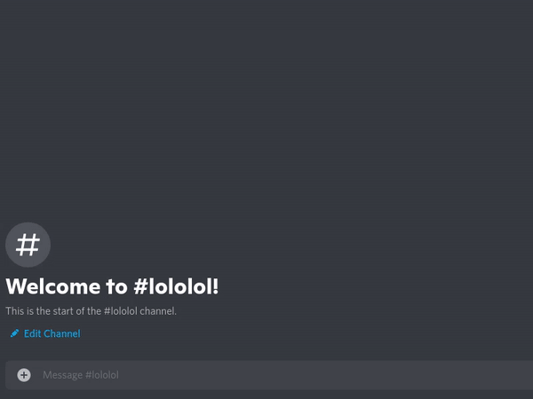

# Sniper Discord Bot - Python Edition

> Like [Dank Memer's sniper bot](https://github.com/DankMemer/sniper), but written in Python.

# Features

Currently, this bot can:

-   Store one deleted message per channel
-   Handle deleted attachments
-   Use the slash command `/snipe` to recover a deleted message

# Setup

Please install these prerequisites:

-   Python 3.8 or higher
-   Git (unless you download as a zip)

1. Create the bot

    1. Go to [the Discord developer portal](https://www.discord.com/developers/applications)
    1. Click the blue `New application` button and give your bot a name
    1. Navigate to the `Bot` submenu and press `Add bot` (and press `Yes, do it!` on the dialogue box)
    1. Save the token for the config.json file
    1. Navigate to the OAuth2 submenu
    1. For the scopes, select `bot` and `applications.commands`
    1. For the bot permissions, make sure it at least has the following:
        - View Channels
        - Send Messages
        - Read Message History
        - Embed Links
        - Use Slash Commands
    1. Then, copy the link in the scopes section. Use that link to add it to your servers

1. Download the bot and install necessary packages

    ```zsh
    $ git clone https://github.com/sheepy0125/sniper-bot-python
    $ cd sniper-bot-python
    $ python3 -m pip install -r requirements.txt
    ```

1. Create config file

    Use the automated config generator

    ```zsh
    $ python3 src/utils/automated_config_generator.py
    ```

    Or make it yourself (save in root directory as config.json, you can rename config.json.example)

    ```json
    {
        "token": "",
        "guild_ids": [],
        "embed_color": "FFFFFF"
    }
    ```

1. Run the bot!

    ```zsh
    $ python3 src/bot.py
    ```

# Usage

## snipe command

1. Delete a message
1. Type `/snipe`
1. Your message will come back to you

    

# Contributing

#### Please follow these rules:

-   Contribute with nice looking, readable, code formatted with Black (if Python) or Prettier (if not Python)
-   Keep it clean (no swear words, obviously)
-   Keep it on point (no music bot or anything)
-   No asking for me to put hashtags / follow you / star a repository / etc. in return for your code
